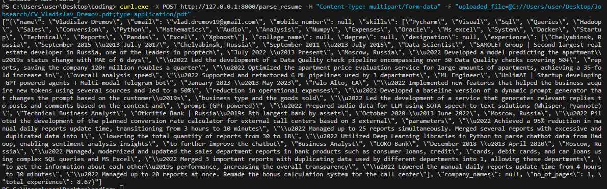

### 1. Definition of the accuracy of the resume parser → How do we evaluate success? (e.g. retrieving the full name of a candidate correctly is more important than extracting the location of his first employer)

Metrics that can be used for quality evaluation are Character error rate and word error rate (used for finding percentage of mis-spelled or incorrect words in final output).

**Fields Retrieval Importance**
|High | Middle | Low |
|-----|--------|-----|
|Previous work titles| Name|Candidate location, gender, photo
|Previous Job descriptions| University Name|University location, years of study
|Action verbs (depending on the position)|University degree|Achievements, hobbies
|Technologies and skillset|Languages
|Time at the company (to avoid job switchers)|Contact data (repo links, website links)
|University major (depending on the position)|About
|Contact data (email, messengers links)|Certifications

### 2. The architecture of the Resume Parser (high-level) - How does it work? (e.g. holistic approach, deep learning models, etc.)

I’ve decided to use the existing package for the initial parser. It converts the incoming file to txt, breaks the document into tokens and retrieves the data using the mix of regular expressions and Named Entity Recognition from SpaCy library on a pretrained dataset of resumes (entities in this context are resume fields). 
There are also Noun Chunks used for skill extraction from the “achievements and responsibilities” text fields.

**Launch example:**

### 3. Milestones to complete the project with an estimated timeline (e.g. initial version with iteration to release gradually)
- Make it async to process the required amount of resumes;
- Adapt the text retrieval process based on the file format (e.g. OCR for non-readable PDFs and picture formats, or extracting text items with their respective locations on the page);
- Apply changes to the initial image files to get better results (image scaling, contrast increase, noise removal, skew correction);
- Improve the text block classification process;
- Use advanced NLP practices to gather more information like skills from "responsibilities" section or candidate’s relevance to the vacancy. For example, if we are looking for a manager, “managed a team of 20 people” will be more relevant than “managed and supported 5 ETL processes”.

### Bonus State of art analysis - How does other resume parser work?
There are many advertised resume parsers on the market, most of them don’t disclose the accuracy rates, but I’ll describe the most interesting ones.
- [OpenResume](https://www.open-resume.com/resume-parser) - parses raw text data + location on the page + text features like bold or new line. Text items are grouped into lines and lines are grouped into sections (based on the text format + relative distance on the page). After that, all text items are clasified to their respective attributes using regex or keyword search.
- [RChilli](https://www.rchilli.com/blog/launching-the-powerful-deep-learning-resume-parsing-module) - uses Named Entity Recognition to determine key fields of the resume.
- NER seems to be a popular approach used with various model architectures. [Model that uses transformers combined with NER](https://github.com/Shavakchauhan/Resume_parser_using_deep_learning/tree/main).
- [Mistral_OCR_to_JSON](https://huggingface.co/mychen76/mistral7b_ocr_to_json_v1) uses SOTA open-source LLM to turn OCR text boxes into JSON.
- [VisionEncoderDecoderModel](https://huggingface.co/docs/transformers/model_doc/vision-encoder-decoder) uses image-to-text pipeline. May be risky since there are many image quality issues that have to be adressed first.
- [TrOCR](https://huggingface.co/docs/transformers/model_doc/trocr) is a part of VisionEncoderDecoderModel framework, shows impressive results on handwritten text, allowing to assume that typed text recognition accuracy will be close to 100%.
